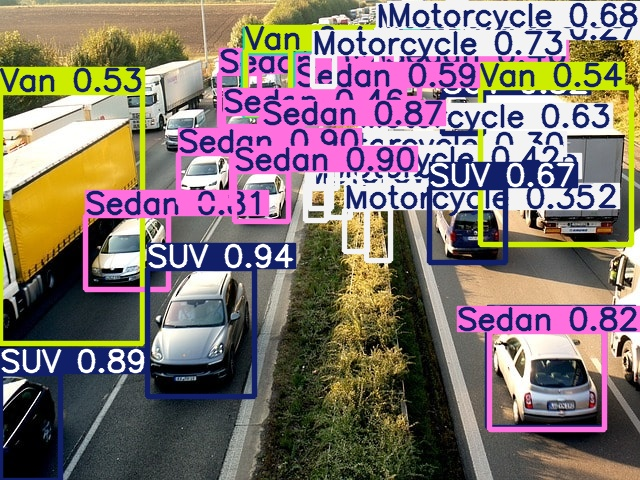

<h1>Projeto de Detecção de Objetos com YOLOv5</h1>

  Este projeto tem como objetivo a criação de um sistema de detecção de objetos utilizando a arquitetura
  <strong>YOLOv5</strong> (You Only Look Once), treinada com um conjunto de dados personalizado. A rede foi treinada para identificar objetos específicos em imagens com alta precisão e velocidade.

<h2>📁 Estrutura do Projeto</h2>
<ul>
  <li><code>dataset/</code> - Contém imagens e anotações (formato YOLO) usadas para o treinamento. <i>O Banco de daodos utilizado foi <a href="https://cocodataset.org/index.htm#download">cocodataset</a>(fora desse commit)</i></li>
  <li><code>yolov5/</code> - Diretório contendo os scripts da rede YOLOv5</li>
  <li><code>runs/train/</code> - Resultados de treinamentos, incluindo pesos salvos</li>
  <li><code>teste.jpg</code> - Imagem usada para teste da rede treinada</li>
</ul>

<h2>⚙️ Treinamento do Modelo</h2>

Para treinar o modelo, execute o seguinte comando:

<pre><code>python yolov5/train.py --img 640 --batch 16 --epochs 50 --data dataset/data.yaml --weights yolov5s.pt --name train</code></pre>

  Após o término do treinamento, o melhor modelo será salvo em:
  <code>runs/train/train/weights/best.pt</code>

<h2>🧪 Teste com Imagem</h2>

Para realizar a inferência em uma imagem específica, utilize o comando abaixo:

<pre><code>python yolov5/detect.py --weights runs/train/train/weights/best.pt --img 640 --conf 0.25 --source teste.jpg</code></pre>

Os resultados serão salvos em um diretório como <code>runs/detect/exp</code>, onde você poderá visualizar as detecções com as caixas delimitadoras.

<h2>📦 Requisitos</h2>
<ul>
  <li>Python 3.8+</li>
  <li>PyTorch</li>
  <li>OpenCV</li>
  <li>Ultralytics YOLOv5</li>
</ul>

<h2>🔧 Instalação</h2>
<pre><code>git clone https://github.com/ultralytics/yolov5
cd yolov5
pip install -r requirements.txt
</code></pre>

<h2>📸 Exemplos</h2>

Resultado da inferência:

